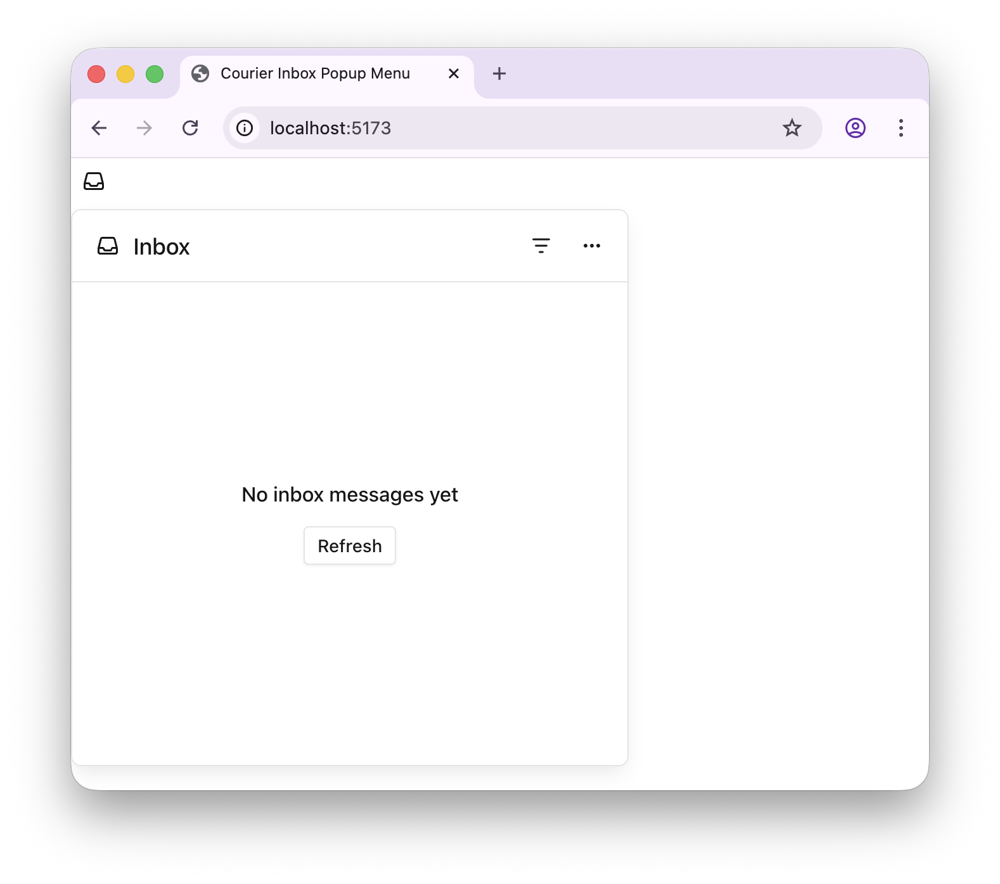
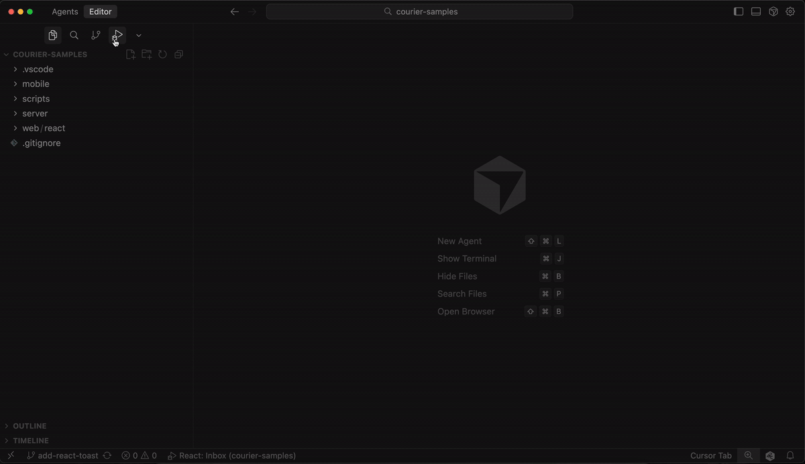

# Courier React Inbox Popup Menu



## Run the app

There are two main ways to run the app:

### Option 1: VS Code Launch Configuration

- Open the Run and Debug panel in VS Code (⌘⇧D / Ctrl+Shift+D)
- Click the play button ▶️
- Select "React: Popup Menu" from the dropdown
- When prompted, enter your Courier API key and user ID
- The JWT token will be automatically generated (or regenerated if expired)
- The dev server will start and automatically open in your browser

### Demo



### Option 2: Command Line

From this directory:

1. Create a `.env` file with:
  ```
  VITE_COURIER_USER_ID=your_user_id
  VITE_COURIER_JWT=your_jwt_token
  ```
2. Run
  ```
  npm i
  ```
3. Run 
  ```
  npm run dev
  ```
4. Open http://localhost:5173 in your browser

## Documentation

For complete reference documentation, see the [Courier React documentation](https://www.courier.com/docs/sdk-libraries/courier-react-web).
